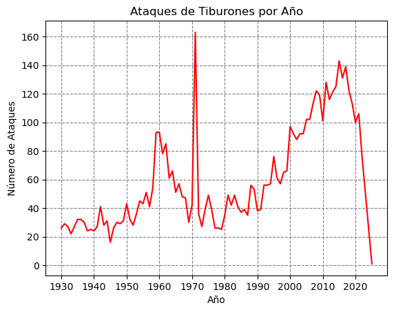
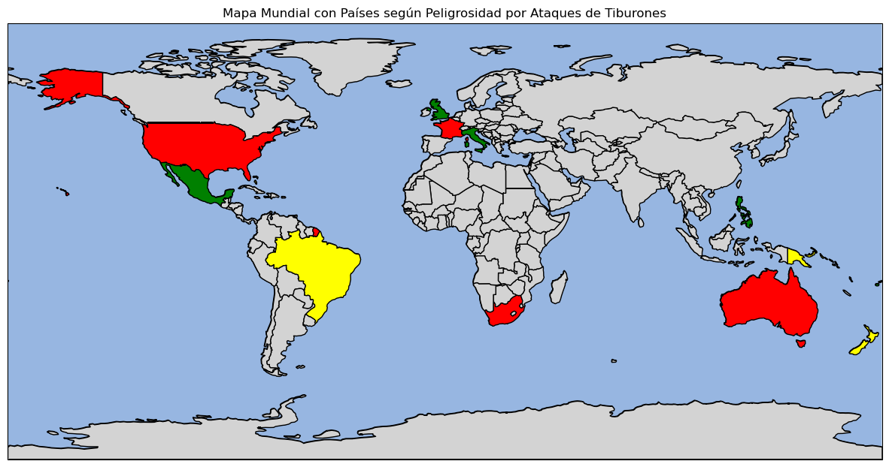
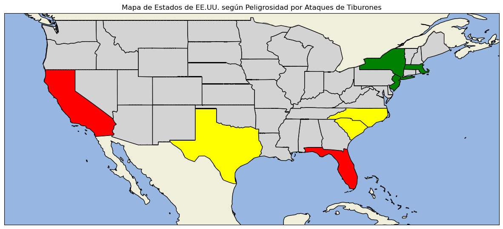
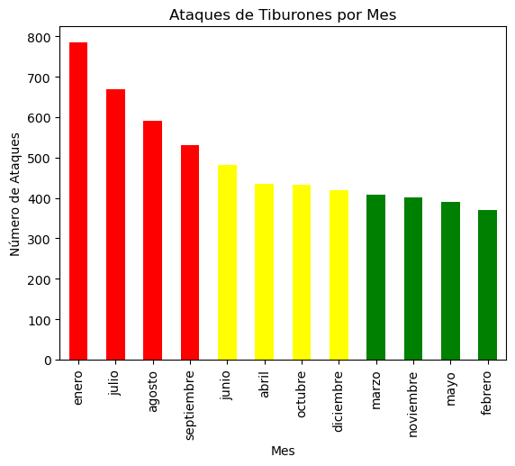
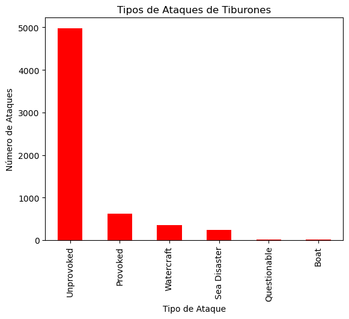
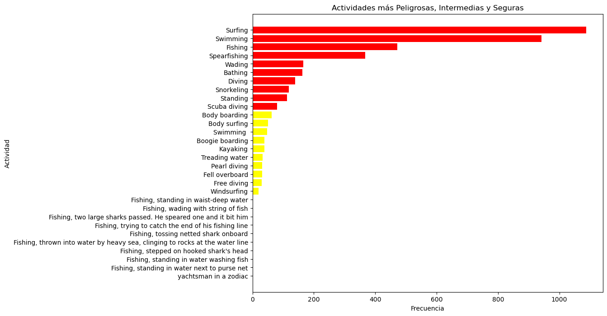
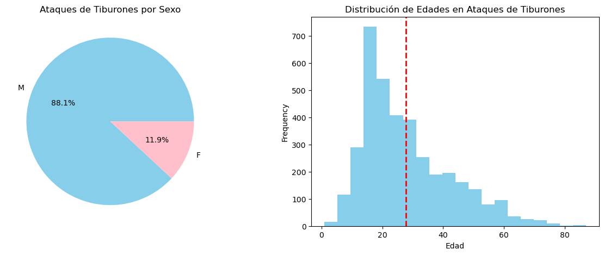

# Shark Attacks

Este proyecto se centra en el análisis de datos de ataques de tiburones a nivel mundial. Utilizando un conjunto de datos detallado, hemos llevado a cabo un Análisis Exploratorio de Datos (EDA) para identificar tendencias, patrones y factores clave relacionados con los ataques de tiburones. A través de visualizaciones y conclusiones significativas, buscamos proporcionar una comprensión más profunda de estos eventos y sus características.

## Análisis Exploratorio de Datos (EDA)

### Evolución Histórica de Ataques de Tiburones

- **Conclusión:** La cantidad de ataques de tiburones ha mostrado una tendencia creciente a lo largo de los años, con picos significativos en décadas recientes.

### Mapa Mundial de Ataques de Tiburones

- **Conclusión:** Estados Unidos, Australia y Sudáfrica son los países con mayor número de ataques de tiburones registrados.

### Mapa de Ataques en Estados Unidos

- **Conclusión:** Florida es el estado con el mayor número de ataques de tiburones en Estados Unidos, seguido por Hawaii y California.

### Distribución de Ataques por Mes

- **Conclusión:** Los meses de enero, julio y agosto presentan el mayor número de ataques de tiburones, mientras que febrero, mayo y noviembre son los meses con menos ataques.

### Tipos de Ataques de Tiburones

- **Conclusión:** La mayoría de los ataques de tiburones son no provocados, seguidos por ataques provocados y relacionados con embarcaciones.

### Actividades con Más Ataques

- **Conclusión:** Surfing y swimming son las actividades con mayor riesgo de ataques de tiburones, mientras que actividades como skin diving y kayak fishing presentan menor riesgo.

### Distribución de Ataques por Edad y Sexo

- **Conclusión:** La mayoría de las víctimas de ataques de tiburones son hombres, y la distribución de edades muestra que los jóvenes son más propensos a ser atacados.